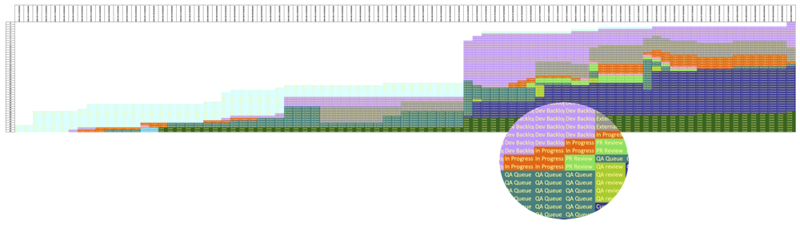
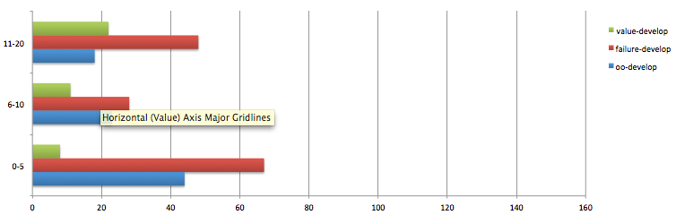
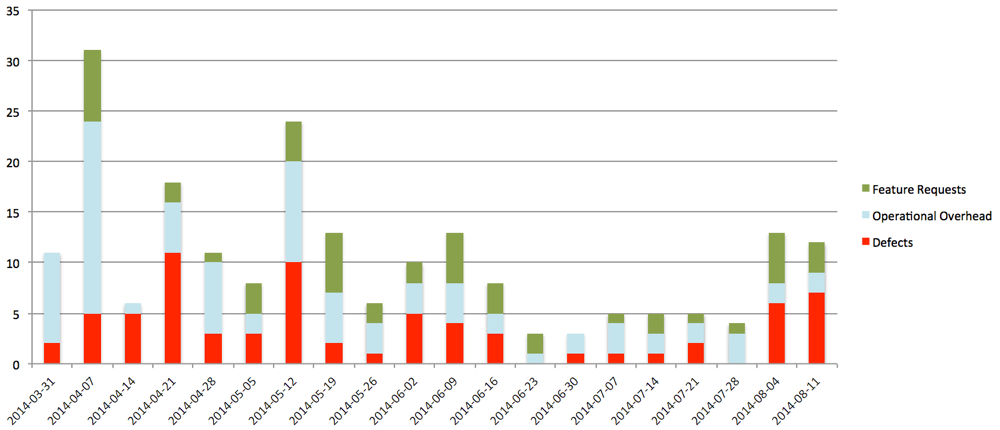
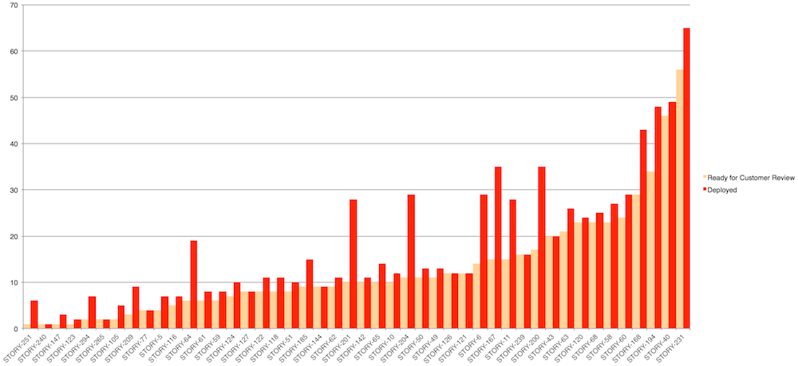
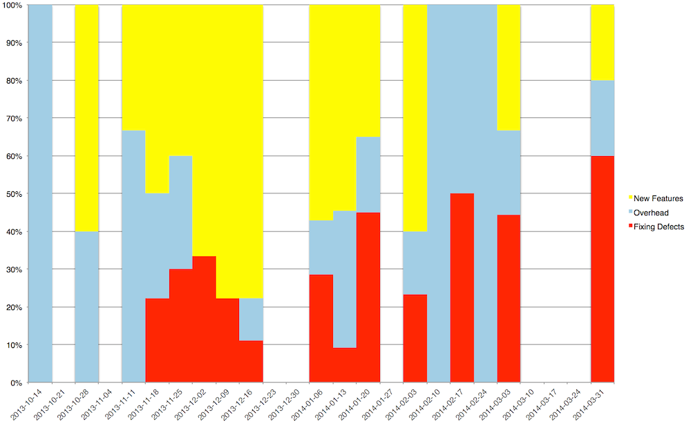
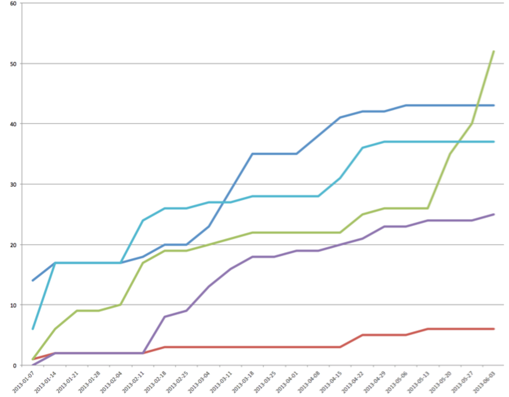
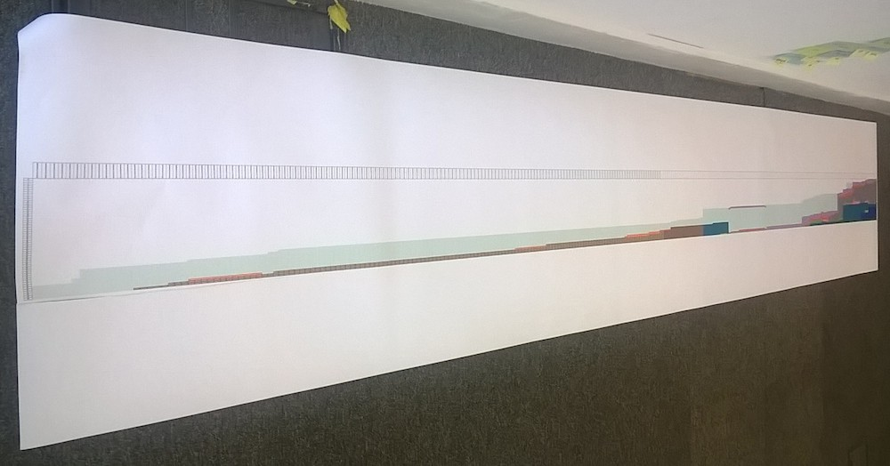
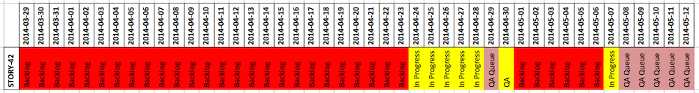
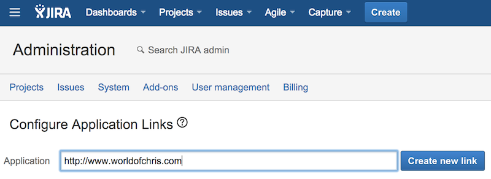
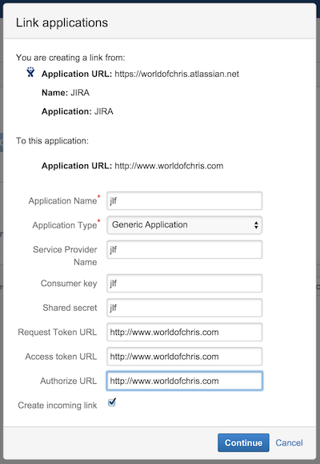

# JIRA _lean forward_ 

## Extract _forward_ looking indicators from JIRA

JLF pulls metrics out of JIRA so we can measure:

* Throughput
* Cycle Time
* Ratio of Overhead / Value / Failure work

It is intended to complement the existing [kanban reporting](https://confluence.atlassian.com/display/AGILE/JIRA+Agile+Documentation) built into Jira Agile.

## Installation

### Dependencies

* Python - tested with 2.7
* Recommened but not essential: Python [virtualenv](https://pypi.python.org/pypi/virtualenv)
* Access to a JIRA instance

### Install Steps

* Clone this repo
* Recommened but not essential: Create and activate a Python virtual environment e.g.

        virtualenv jlf
        source jlf/bin/activate
    
* Install with setup.py

        python setup.py install
    
## Configuration

To start getting metrics out of JIRA you'll need a JSON config file describing your JIRA instance, the filters for the issues you want to report on, different types of work, cycles and the metrics you want to extract.

### Jira Instance

JLF needs to know where to look for the issues to report on.  You need to provide a server URL, and authentication credentials.  These can either be basic authenticion using username and password:

    "server": "https://worldofchris.atlassian.net",
    "authentication": {
        "username": "readonly",
        "password": "WTFFTW!"
    },
    
 or OAuth:

    "server": "https://worldofchris.atlassian.net",
    "authentication": {
        "access_token": "In3d5YsFmqRTDJah2gg5sNH0WM2ekKzA",
        "access_token_secret": "9COeo40njrZGgMU8GjqjdEpKye6TLDXJ",
        "consumer_key": "jlf",
        "key_cert": "/path/to/cert.pem"
    }
 
Configuring OAuth access to JIRA is described in more detail at the end of this README.     
    
### Categories

You can get metrics one or a number of separate sets of issues.  Typically these might be all the issues associated with a particular project or with a specific release (FixVersion) of a project

    "categories": {
        "project-x": "(project = 'Project X')"
        "infrastructure-work": "('Epic Link' = INF-250)",
    },

### Types

The principal motivation for writing JLF was to be able to report on how much work was adding value and how much work was due to failure demand.  To do this JLF allows you to group JIRA issue types accordingly:

    "types": {
        "failure": ["Bug", "Fault"],
        "value": ["New Feature", "Story", "Improvement"],
        "oo": ["Task", "Decision", "User Support", "Spike"]
    },

### Cycles

Another motivation was to be able to compare different cycles within the end to end value chain.  For example, to compare how long it took for work to get from the start of development to being ready for the customer to review with how long it took to actually get into production.

To do this JLF lets you specify a number of cycles.  Each cycle is described in terms of a start state, and end state and an optional state from which transitions can be ignored.  This last option is to allow for workflows where issues cannot be edited after they have been closed but are re-opened for administrative purposes, such as to change the assignee or the resolution type:

    "cycles": {
        "deployment": {
            "start":  "In Progress",
            "end":    "Closed",
            "ignore": "Reopened" 
        },
        "customer-queue": {
            "start": "In Progress",
            "end": "Awaiting Customer Review",
            "ignore": "Reopened"
        }
    },

### States

If you want to report on any metrics which need to know about state order, ie. CFDs, you need to specify the states and their order in the config:

    "states": ["Open",
               "Dev Backlog",
               "In Progress",
               "PR Queue",
               "PR Review",
               "QA Queue",
               "QA review",
               "Customer Queue",
               "Customer Review",
               "Approved for Deployment",
               "Closed"],

### Definition of Done

In order to calculate throughput, JLF needs to know what constitutes a successfully completed piece of work.  By default this is:

     AND issuetype in standardIssueTypes() AND resolution in (Fixed) AND status in (Closed)
     
This will most likely not fit all workflows so you can configure it to match yours with:

    "counts_towards_throughput": " AND issuetype in standardIssueTypes() AND status in (Closed)",

### Metrics

The output of JLF appears in an Excel (.xlsx) spreadsheet.  Other output formats are planned but for now you just need to specify Excel format with:

    "format": "xlsx",

The name of the spreadsheet is set with:

    "name": "reports",

The location the spreadsheet should be written to is set with:

    "location": "."

The metrics to be included are then specified in:

    "reports": [..],
        
The following metrics are available and can be configured as described below:

#### Cycle Time Histogram

How long does it take us to get work done?

You can specify the types of work and the cycle you want to report on:

        {
            "metric": "cycle-time",
            "types": [
                "value", "failure", "oo"
            ],
            "cycles": [
                "develop"
            ],
            "buckets": [0,6,11,21,51,"max"]
        }

You can optionlly specify your bucket edges to determine how the issues will be grouped.  The keyword "max" denotes the largest cycle length found.

You can then graph the resulting data like this:

#### Demand

What sort of work are we being asked to do?  How much of it is to add value?  How much of it is dealing with defects or problems in the system?  How much of it is operational overhead?

This metric allows you to produce graphs like this one:

This project is generating around four defects a week!

        {
            "metric": "demand",
            "categories": "foreach",
            "types": [
                "failure", "value", "oo"
            ]
        },

#### Detail

This report lists all JIRA issues along with their cycle times.

This report is used to create simple bar chart control charts:

 

Here you can see the cycle time for getting as far as being ready for customer review and the cycle time for actually getting to deployment.

On this project the team were pretty good at working with the customer to get work reviewed and deployed as soon after development as possible.  There were as you can see some notable exceptions.

See Section 12.3 of Henrik Kniberg's *Lean from the Trenches* for some great examples and insights on using bar graphs as control charts.

        {
            "metric": "done",
            "categories": "foreach",
            "types": "foreach",
            "sort": "week-done"
        },

#### Throughput

How much work do we complete each week?

This report is used to create a bar chart showing how much of throughput is devoted to different types of work:

On this project you can see the amount of throughput dedicated to addressing failure demand start to increase as the weeks go by.  The more time spent fixing defects, the less can be spent adding new features.

        {
            "metric": "throughput",
            "categories": "foreach",
            "types": [
                "failure", "value", "oo"
            ]
        },
  
#### Cumulative Throughput

This is a simpler view than Cumulative Flow and is particularly useful if you want to compare a number of concurrent projects or workstreams:

In this graph we see a number of concurrent projects, several of which are flatlining because the team simply have too many projects in flight at once!

Chapter 12 of Henrik Kniberg's *Lean from the Trenches* is very good on using cumulative throughput, or velocity as he calls it, as a feedback mechanism for managing work.

        {
            "metric": "cumulative-throughput",
        },

#### Cumulative Flow

You can make some pretty big Cumulative Flow Diagrams:

The CFD currently reports on the whole timespan of the issues retrieved from JIRA.  To specify a CFD report you just need to include the metric in the config:

        {
            "metric": "cfd"
        },

To override the default colours you can specify a colour for each state:

        {
            "metric": "cfd",
            "format": {       "Open": {"color": "#ffffd9"},
                       "Dev Backlog": {"color": "#edf8b1"},
                       "In Progress": {"color": "#c7e9b4"},
                          "PR Queue": {"color": "#7fcdbb"},
                         "PR Review": {"color": "#41b6c4"},
                          "QA Queue": {"color": "#1d91c0"},
                         "QA review": {"color": "#1d91c0"},
                    "Customer Queue": {"color": "#225ea8"},
                   "Customer Review": {"color": "#253494"},
           "Approved for Deployment": {"color": "#225ea8"},
                            "Closed": {"color": "#253494"}}
        },

#### Issue History

Issue History is based on Benjamin Mitchell's blog post on [item history tracking](http://blog.benjaminm.net/2012/06/26/how-to-study-the-flow-or-work-with-kanban-cards).

I find it useful for showing specific examples of work that has spent a long time waiting to be worked on, or has come back round through the development cycle several times:

        

        {
            "metric": "history",
            "types": "foreach"
        },

## Use

Once you have a config file you can run jlf with:

        jlf -c CONFIG_FILE -n NUM_WEEKS
        
Where `CONFIG_FILE` is the path to your config file and `NUM_WEEKS` is the number of weeks of work you want to report on.

## Development

### Running the tests

* Run the tests with:

        nosetests

* To run a single test, specify the path to the module, the Test Case Class Name and the test Case Name.  e.g.

        nosetests jira_stats.test.test_jira_wrapper:TestGetMetrics.testGetArrivalRate

## Configuring OAuth access to JIRA

If you are using OAuth to access JIRA you need to add an Application Link to your JIRA instance and then do the OAuth Dance to obtain your Access Token and Access Token Secret.

### Generating a Key Pair

The Application Link requires the public key of an RSA key-pair.  You then use the private key to do the OAuth Dance.

If you don't have one already you can generate them with:

    openssl genrsa -out jira.pem 1024
    openssl rsa -in jira.pem -pubout -out jira.pub

Thanks to [beeplogic](https://answers.atlassian.com/questions/45037/how-do-you-configure-jira-to-use-oauth-with-a-generic-application-specifically-jenkins) for the commands for generating an RSA key-pair.

### Adding an Application Link

As an adimistrator, under Administration | Add-ons | Application Links enter a URL to identify _jlf_:

Even though _jlf_ is a console app and does not have a URL you have to identify it with a URL.  You will get a warning that "No response was received from the URL you entered" which you can safely ignore.

You can re-use this URL for the Request Token URL, Access token URL amd Authorize URL:

**Create incoming link needs** to be checked.

### Doing the OAuth Dance

To get an Access Token and Access Token Secret run jirashell with the following flags:

 * `-od` tells jirashell to do the OAuth Dance.
 * `-k` path to the private key of your RSA key-pair.
 * `-ck` Consumer key specified in the Application Link.
 * `-pt` tells jirashell to print out the Access token and Access token secret.  

For example:

        jirashell -s https://worldofchris.atlassian.net -od -k ~/.ssh/jira.pem -ck jlf -pt
        Request tokens received.
            Request token:        G92UPCBWLOvDYr2kfrZoKTmC8QyZtQ36
            Request token secret: uckUts4NPZ0jcuEwgQL6WDcx78vxHTQM
        Your browser is opening the OAuth authorization for this client session.
        Have you authorized this program to connect on your behalf to https://worldofchris.atlassian.net? (y/n)y
        Access tokens received.
            Access token:        Akif9EqT7FqslmUctbnHxVRD2tmbFcHu
            Access token secret: uckUts4NPZ0jcuEwgQL6WDcx78vxHTQM
        <JIRA Shell 0.16 (https://worldofchris.atlassian.net)>

        *** JIRA shell active; client is in 'jira'. Press Ctrl-D to exit.
